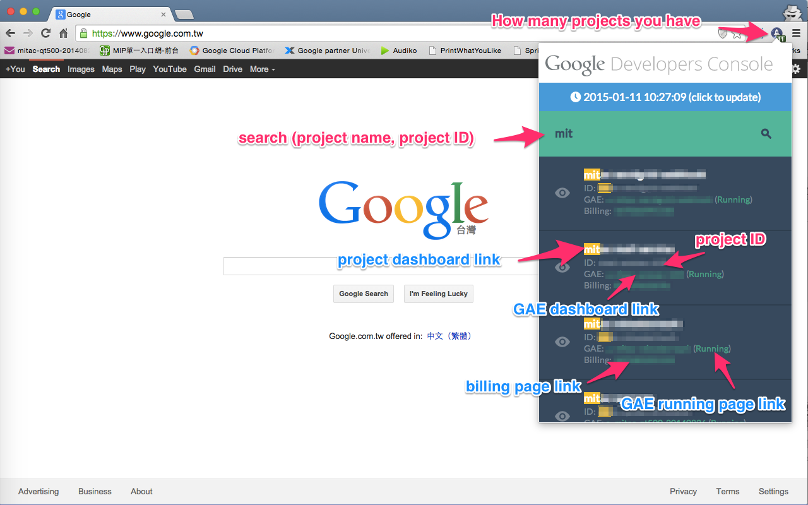
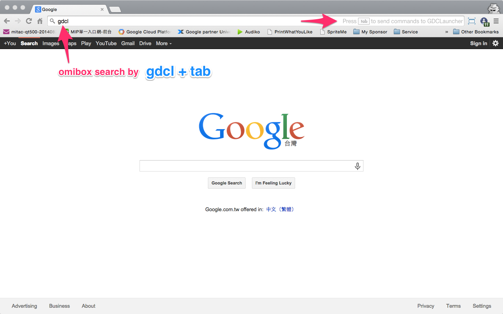
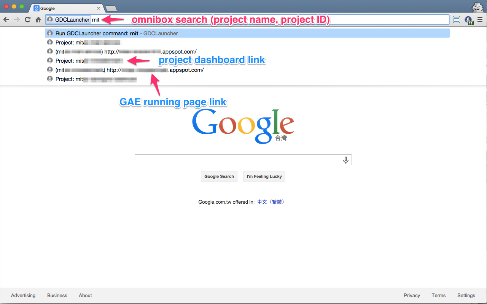
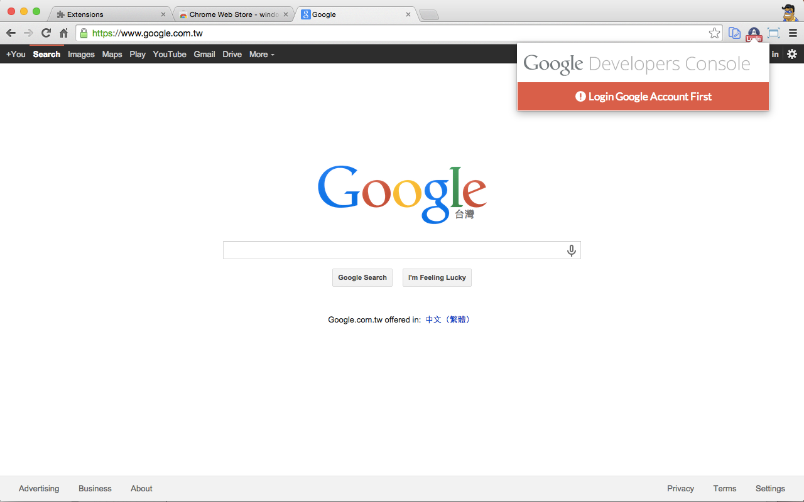

#GDCLauncher

One way to quick launch Google Developers Console.

##features

features:

1. pop window to check Google Developers Console project list.
  - search project name, project ID
  - project dashboard link
  - GAE dashboard link
  - GAE running link
  - billing page link
2. omnibox search

##Snapshot

##Chrome web store

[GDCLauncher - Chrome Web Store](https://chrome.google.com/webstore/detail/gdclauncher/bicgkglnnilldakpenngnblekooejnpg)