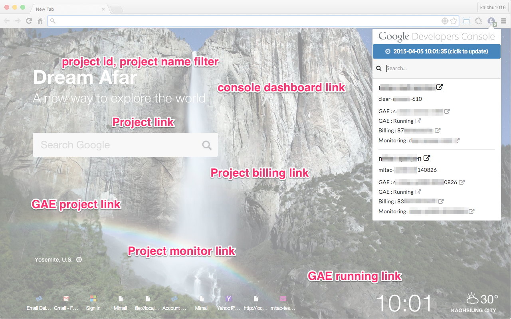
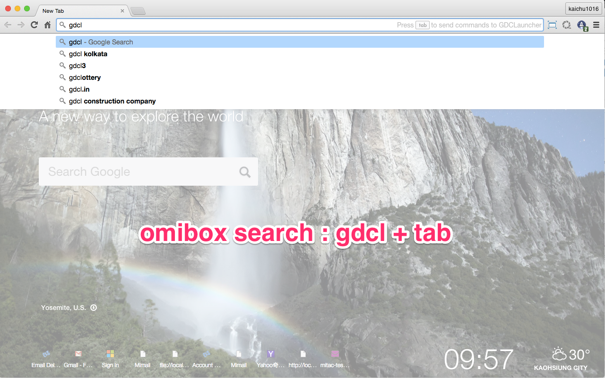
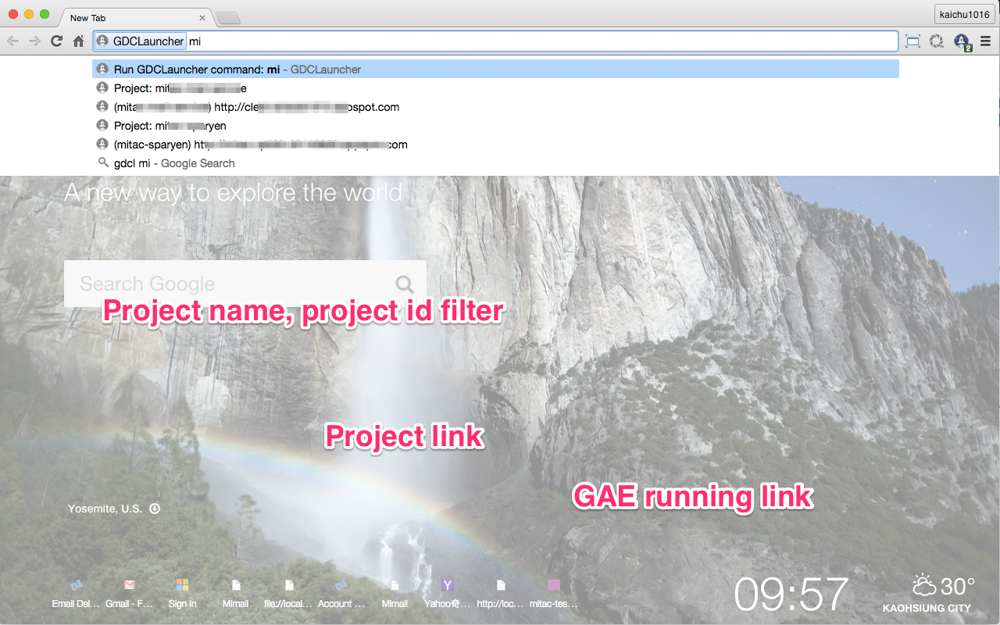
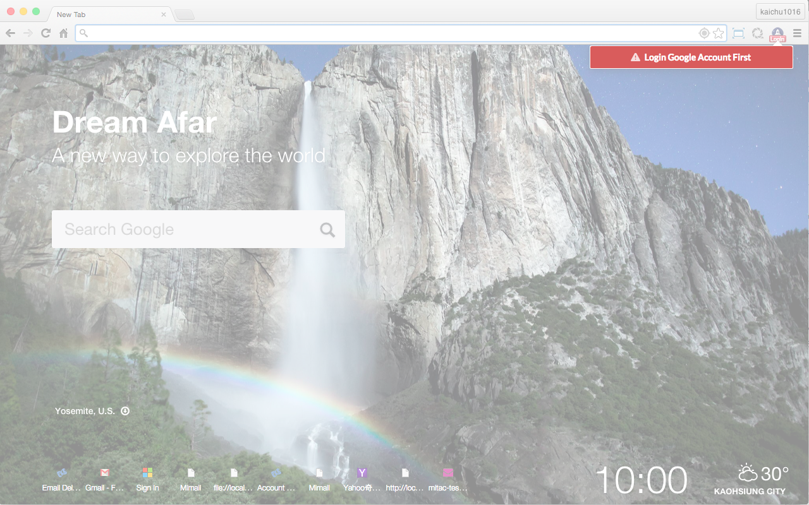

#GDCLauncher

One way to quick launch Google Developers Console.

##features

features:

1.	pop window to check Google Developers Console project list.
	-	search project name, project ID
	-	project dashboard link
	-	GAE dashboard link
	-	GAE running link
	-	billing page link
	-	monitoring page link
2.	omnibox search

##Change Log

### 2016.9.10

- fixed AppEngine link does not work
- add copy project id feature

### 2016.9.1

- fixed login does work issus cause GCP console renew

### 2015.4.5

-	change UI themes from bootstrap to semantic-ui
-	code refactoring via reactjs and commonjs way

### 2015.1.29

-	monitoring page link
-	UI minor modify

##Snapshot

##Chrome web store

[GDCLauncher - Chrome Web Store](https://chrome.google.com/webstore/detail/gdclauncher/bicgkglnnilldakpenngnblekooejnpg)
